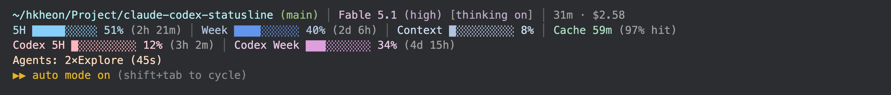

# claude-codex-statusline

Claude Code + Codex CLI 사용량을 터미널 상태바에 실시간으로 표시하는 statusline 스크립트.

**English:** A statusline for Claude Code that displays rate-limit usage bars, context window, prompt-cache TTL, effort level, git branch, session time, Codex CLI budgets, and active subagent counts — all rendered inline in the Claude Code TUI. Every segment can be toggled on/off.



---

## Quick install

```bash
curl -fsSL https://raw.githubusercontent.com/kiheon0709/claude-codex-statusline/main/install.sh | bash
```

재실행해도 안전합니다 (idempotent).

---

## 표시 항목

```
~/hkheon/Project/claude-codex-statusline (main) │ Fable 5.1 (high) [thinking on] │ 31m · $2.58
5H ████░░░░░░ 51% (2h 21m) │ Week ████░░░░░░ 40% (2d 6h) │ Context █░░░░░░░░░ 8% │ Cache 59m (97% hit)
Codex 5H ██░░░░░░░░ 12% (3h 2m)
Agents: 2×Explore (45s)
```

- **Directory / Model** — 현재 작업 디렉터리 + git 브랜치(저장소 안일 때만) + 사용 중인 Claude 모델명 + effort 레벨 (예: `Fable 5.1 (high)`, xhigh/max는 노란색)
- **Badges** — 모델 옆에 thinking 상태를 항상 표시 (`[thinking on]`은 연한 색, `[thinking off]`는 노란색). fast mode는 켜져 있을 때만 `fast` 배지 추가
- **Session** — 세션 경과 시간과 추정 비용 (예: `1h 13m · $1.23`)
- **Cache** — 프롬프트 캐시가 식기까지 남은 시간과 히트율 (예: `Cache 42m (91% hit)`, 식으면 `Cache cold`). 캐시가 만료되면 다음 요청에서 대화 전체를 다시 캐시에 쓰므로 자리 비울 때 참고
- **Claude 5H / Week / Context** — Claude Code의 공식 statusline 페이로드에서 직접 읽어오는 rate-limit 바 (추가 API 호출 없음)
- **Codex 5H / Week / 30D** — 로컬 `~/.codex/sessions/.../rollout-*.jsonl` 파일에서 파싱하는 Codex CLI 사용량 바. Codex가 보고하는 창(`window_minutes`)에 맞춰 라벨을 붙이며, 최신 Codex처럼 창이 하나만 오면 하나만 표시. 리셋 시각이 지난(오래된 로그) 창은 숨김
- **Active Agents** — PreToolUse/PostToolUse 훅으로 추적하는 실행 중인 서브에이전트 카운터 (시작 후 경과 시간 포함)

사용량이 80% 이상이면 `!` 경고, 95% 이상이면 `⚠` 알림이 표시됩니다.

---

## 기능 켜고 끄기

기능이 많아졌으니 필요 없는 항목은 끌 수 있습니다. 설치된 스크립트가 그대로 CLI 역할을 합니다.

```bash
node ~/.claude/statusline.mjs list                # 현재 상태 보기
node ~/.claude/statusline.mjs off cache session   # 끄기 (여러 개 가능)
node ~/.claude/statusline.mjs on cache            # 다시 켜기
```

| 이름 | 표시 항목 |
|------|-----------|
| `branch` | 디렉터리 옆 git 브랜치 |
| `effort` | 모델 옆 effort 레벨 |
| `badges` | `[thinking on/off]` · `[fast]` 배지 |
| `session` | 세션 경과 시간 · 추정 비용 |
| `limits` | Claude 5H / Week 바 |
| `context` | Context 바 |
| `cache` | 프롬프트 캐시 남은 시간 · 히트율 |
| `codex` | Codex 사용량 바 |
| `agents` | 서브에이전트 카운터 |

설정은 `~/.claude/statusline.json`에 `{ "disabled": ["cache", "session"] }` 형태로 저장되며, 직접 편집해도 됩니다. Claude Code 재시작 없이 다음 갱신부터 반영됩니다.

---

## Requirements

- **Claude Code** (Claude Code가 Node.js를 번들로 포함하므로 별도 설치 불필요)
- **Node.js** — Claude Code 번들 Node.js 사용
- **macOS or Linux** — Windows는 테스트되지 않음
- **Codex CLI** (선택) — 설치하지 않아도 동작하며, Codex 바는 사용 이력이 있을 때만 표시됨

---

## Manual install (clone)

```bash
git clone https://github.com/kiheon0709/claude-codex-statusline.git
cd claude-codex-statusline
./install.sh
```

---

## Uninstall

클론된 레포에서:

```bash
./uninstall.sh
```

또는 원라이너:

```bash
curl -fsSL https://raw.githubusercontent.com/kiheon0709/claude-codex-statusline/main/uninstall.sh | bash
```

---

## How it works

**Claude 데이터**: Claude Code가 statusline 커맨드를 실행할 때 stdin으로 JSON 페이로드를 전달합니다. `statusline.mjs`는 이 페이로드에서 `rate_limits`, `context_window`, `prompt_cache`, `model`, `effort`, `thinking`, `fast_mode`, `cost`, `workspace` 등을 읽어 바를 렌더링합니다. 별도 네트워크 호출 없음.

**Codex 데이터**: `~/.codex/sessions/` 하위에서 가장 최근에 수정된(mtime 기준) `rollout-*.jsonl` 파일에서 `grep`으로 `rate_limits` 키가 포함된 마지막 줄을 추출해 JSON 파싱합니다. 파일 크기에 무관하게 빠릅니다.

**Agent 추적**: `hooks/agent-start.mjs`(PreToolUse)와 `hooks/agent-end.mjs`(PostToolUse)가 `Agent` 툴 호출 시마다 OS 임시 디렉터리(`os.tmpdir()`)의 `claude-agents.json`을 원자적으로 업데이트합니다. Statusline은 이 파일을 읽어 현재 실행 중인 서브에이전트를 표시합니다.

**텔레메트리 없음.** 설치 스크립트의 파일 다운로드 외에 네트워크 통신은 없습니다.

---

## Files installed

설치 후 생성/수정되는 파일:

| 파일 | 설명 |
|------|------|
| `~/.claude/statusline.mjs` | 메인 statusline 렌더러 |
| `~/.claude/hooks/agent-start.mjs` | Agent PreToolUse 훅 |
| `~/.claude/hooks/agent-end.mjs` | Agent PostToolUse 훅 |
| `~/.claude/statusline.json` | 기능 on/off 설정 (처음 `off` 실행 시 생성) |

`~/.claude/settings.json`에 추가되는 키:

- `statusLine` — `{ type: "command", command: "node ~/.claude/statusline.mjs" }`
- `hooks.PreToolUse[]` — matcher `Agent`, command `agent-start.mjs`
- `hooks.PostToolUse[]` — matcher `Agent`, command `agent-end.mjs`

---

## License

MIT — Copyright (c) 2026 [kiheon0709](https://github.com/kiheon0709)
